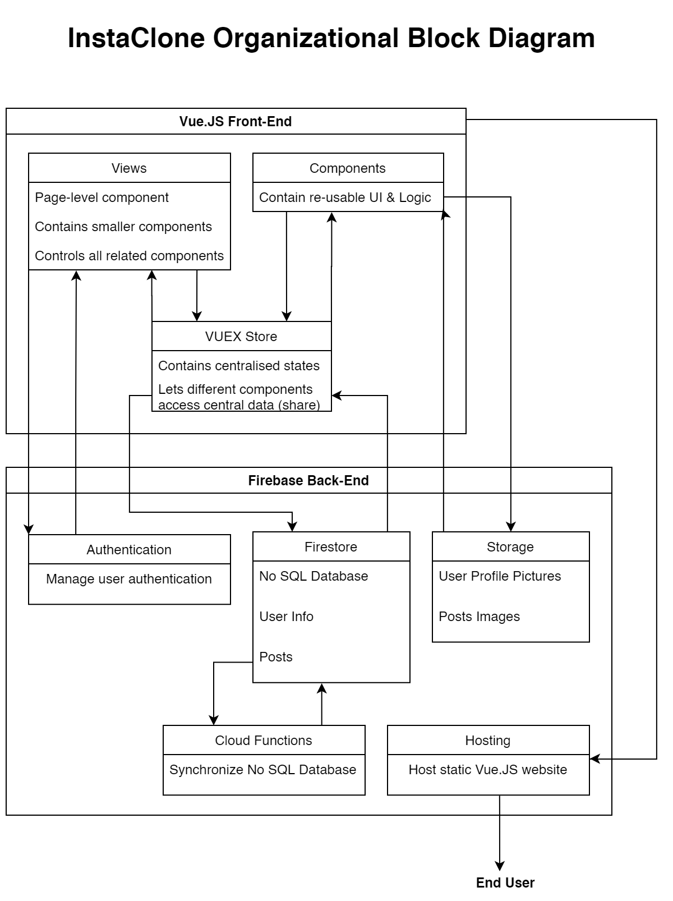

# Instaclone

This project is meant to be an Instagram clone and was created for Concordia's SOEN 341 (Software Process) Course.

**[Link to the website](https://soen341-instaclone.web.app/)**

---

### Written by:

- Manar Alchirazi Alsabbagh - **LerouxManar** - *(40058611)*
- Radley Carpio - **radley-carpio** - *(40074888)*
- Stephen Frattaroli - **sfratt** - *(27567634)*
- Seyedeh Mansoureh Edalati Mirzabeigi - **mansiedi1980** - *(40037283)*
- Hoda Nourbakhsh - **hodanourbakhsh** - *(40066450)*
- Pierre-Olivier Trottier - **po-trottier** - *(40059235)*

### Objectives:

- Imitate the main features Instagram offers to users
- Core features:
    - ~~Being able to see a landing page when i'm not logged in~~
    - ~~Being able to log in~~
    - ~~Being able to post a photo~~
    - ~~Being able to follow the users~~
    - ~~Being able to create an account~~
    - ~~Being able to comment on the post~~
    - ~~Being able to log in using Google and Facebook~~
    - Being able to add a description with Hashtags to the post
    - ~~Being able to search for users~~
    - Being able to search for Hashtags and see related posts
    - Having a customizable personal profile
    - ~~Having access to the app in French and in English~~ *Will not implement*
    
### Acceptance Tests    
    
|Step to take|Expected Output|
|---|---|
|Open the website|Should see a welcome page that lets you login and create a new account|
|Click the create an account button|Should bring you to a new page that lets you create a new account and set profile details|
|Create an account|Should log you in after the account creation is succesful and bring you to the feed|
|Back at the welcome screen, if you fill in your information and click log in|Should log you in after the account creation is succesful and bring you to the feed|
|On the feed, if you click the like button on a post|The post's like counter should go up if it's not already liked or down if it is. The heart button should also change colors accordingly (red = liked, grey = not liked)|
|If you click on a post's image|You should be brought to that post's details page where you can see the comments on that post|
|On the feed, if you click on the user name or image|You should be brought to that user profile page.|
|Wherever on the app, if you click on the instagram logo in the banner|You should be brought to the user feed.|

### Technology Stack

- Frontend:
    - *Vue.JS*
- Backend:
    - *Firebase Functions + Firebase Authentication*
- Database:
    - *Firebase Firestore + Firebase Storage*
- Continuous Integration
    - *GitHub Actions*
- Hosting:
    - *Firebase Hosting*
- Unit Testing:
    - *Mocha + Chai*

### Organizational Block Diagram

### Useful Commands

- Deploy to Firebase
    - `npm run deploy`
- Run Firebase Emulators
    - `npm run emulate`
- Install All Required Dependencies
    - `npm run install-all`
- Install Front-End Dependencies
    - `npm run install-frontend`
- Install Firebase Functions Dependencies
    - `npm run install-functions`
- Lock Front-End Environment Variables
    - `npm run lock-frontend PASSWORD_HERE`
- Lock Firebase Functions Environment Variables
    - `npm run lock-functions PASSWORD_HERE`
- Unlock Front-End Environment Variables
    - `npm run unlock-frontend PASSWORD_HERE`
- Unlock Firebase Functions Environment Variables
    - `npm run unlock-functions PASSWORD_HERE`

### Useful Links

- [Frontend README](https://github.com/po-trottier/concordia-software-processes/blob/master/frontend/README.md)
- [Backend README](https://github.com/po-trottier/concordia-software-processes/blob/master/functions/README.md)
