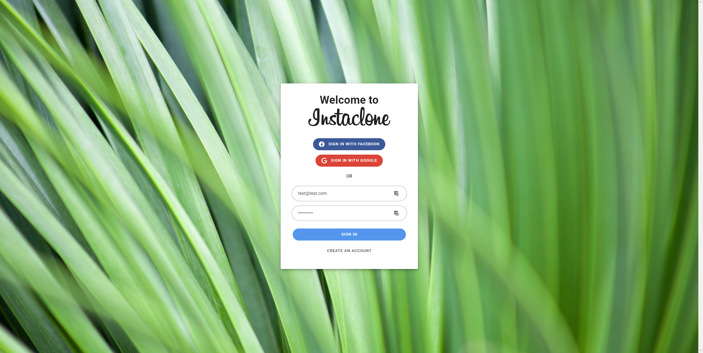
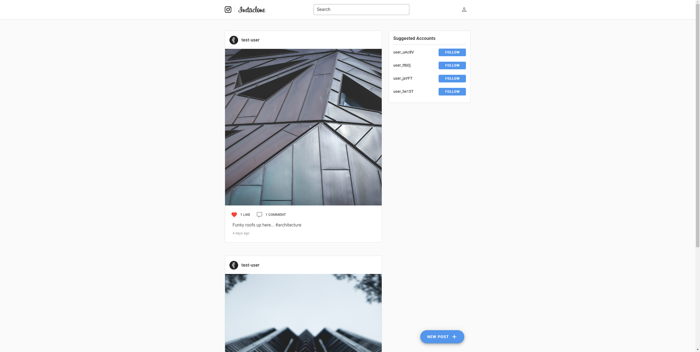
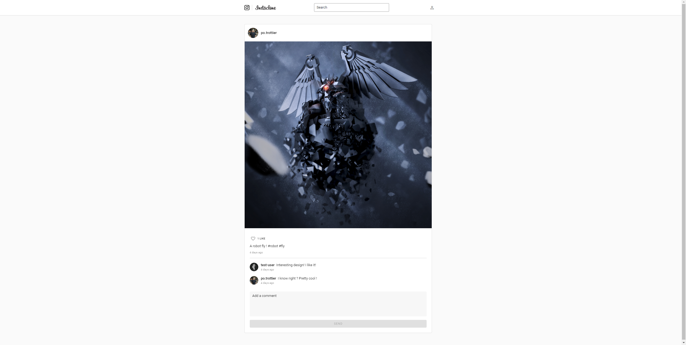
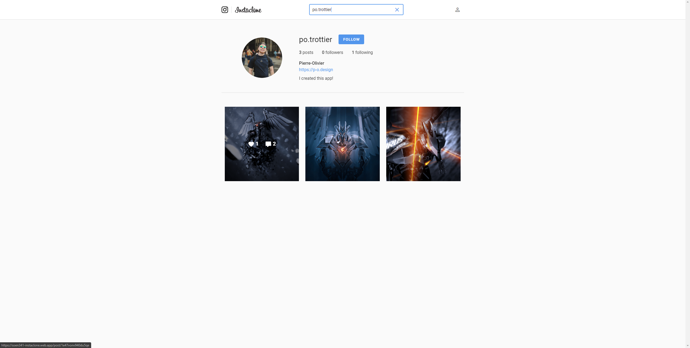
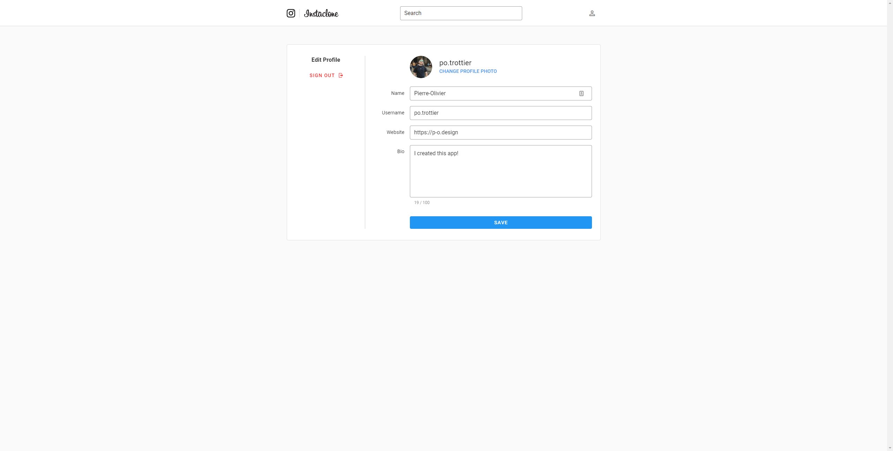
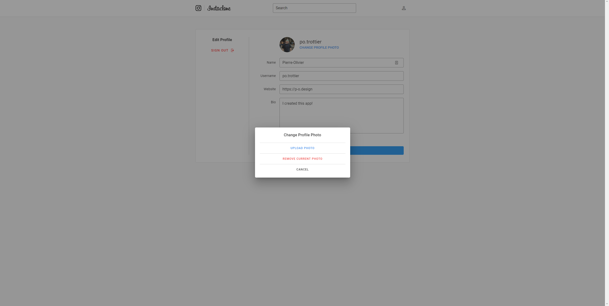
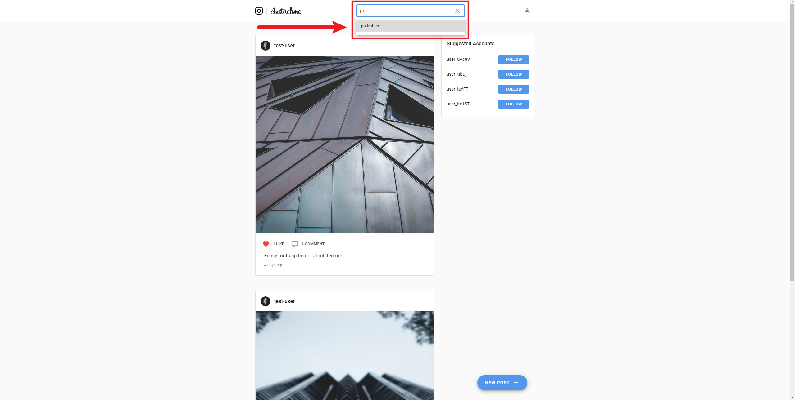

# Instaclone

This project is meant to be an Instagram clone and was created for Concordia's SOEN 341 (Software Process) Course.

**[Link to the website](https://soen341-instaclone.web.app/)**

---

### Written by:

- Manar Alchirazi Alsabbagh - **LerouxManar** - *(40058611)*
- Radley Carpio - **radley-carpio** - *(40074888)*
- Stephen Frattaroli - **sfratt** - *(27567634)*
- Seyedeh Mansoureh Edalati Mirzabeigi - **mansiedi1980** - *(40037283)*
- Hoda Nourbakhsh - **hodanourbakhsh** - *(40066450)*
- Pierre-Olivier Trottier - **po-trottier** - *(40059235)*

### Objectives:

- Imitate the main features Instagram offers to users
- Core features: **DONE**
    - ~~Being able to see a landing page when i'm not logged in~~
    - ~~Being able to log in~~
    - ~~Being able to post a photo~~
    - ~~Being able to follow the users~~
    - ~~Being able to create an account~~
    - ~~Being able to comment on the post~~
    - ~~Being able to log in using Google and Facebook~~
    - ~~Being able to add a description with Hashtags to the post~~
    - ~~Being able to search for users~~
    - ~~Having a customizable personal profile~~
    - ~~Being able to search for Hashtags and see related posts~~ *Will not implement*
    - ~~Having access to the app in French and in English~~ *Will not implement*
    
### Acceptance Tests    
    
See the `features` directory of the project.

### Technology Stack

- Frontend:
    - *Vue.JS*
- Backend:
    - *Firebase Functions + Firebase Authentication*
- Database:
    - *Firebase Firestore + Firebase Storage*
- Continuous Integration
    - *GitHub Actions*
- Hosting:
    - *Firebase Hosting*
- Unit Testing:
    - *Mocha + Chai*

### Organizational Block Diagram

### Screenshots

**For a better experience, [navigate to the hosted website directly](https://soen341-instaclone.web.app/).**

 Landing Page (also the login/sign up page)
 Main Posts Feed
 Post Details Page where Comments can be Added
 Page where new posts are created and uploaded 
 User Profile Page (When viewing your own profile, a `Edit Profile` button is visible instead of the `Follow` button)
 Page where the profile details can be modified
 Dialog where the profile picture can be updated
 Search for users to follow

### Useful Commands

- Deploy to Firebase
    - `npm run deploy`
- Run Firebase Emulators
    - `npm run emulate`
- Install All Required Dependencies
    - `npm run install-all`
- Install Front-End Dependencies
    - `npm run install-frontend`
- Install Firebase Functions Dependencies
    - `npm run install-functions`
- Lock Front-End Environment Variables
    - `npm run lock-frontend PASSWORD_HERE`
- Lock Firebase Functions Environment Variables
    - `npm run lock-functions PASSWORD_HERE`
- Unlock Front-End Environment Variables
    - `npm run unlock-frontend PASSWORD_HERE`
- Unlock Firebase Functions Environment Variables
    - `npm run unlock-functions PASSWORD_HERE`

### Useful Links

- [Frontend README](https://github.com/po-trottier/concordia-software-processes/blob/master/frontend/README.md)
- [Backend README](https://github.com/po-trottier/concordia-software-processes/blob/master/functions/README.md)
